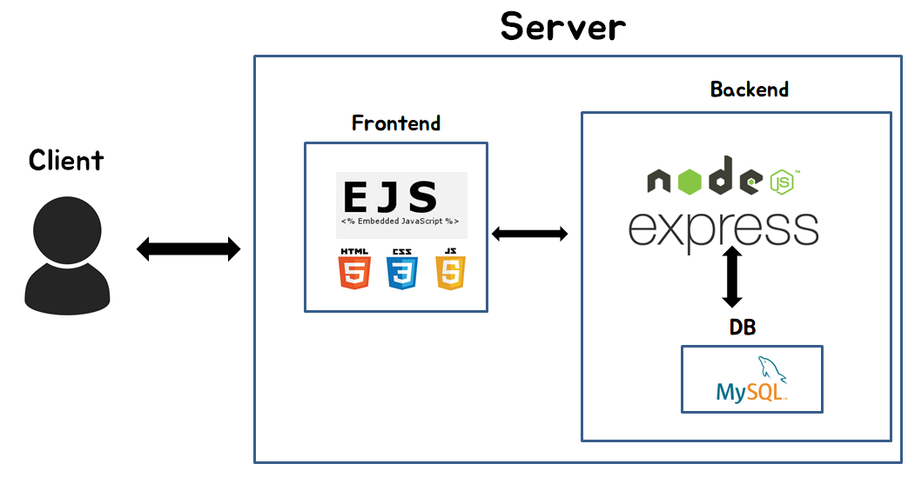
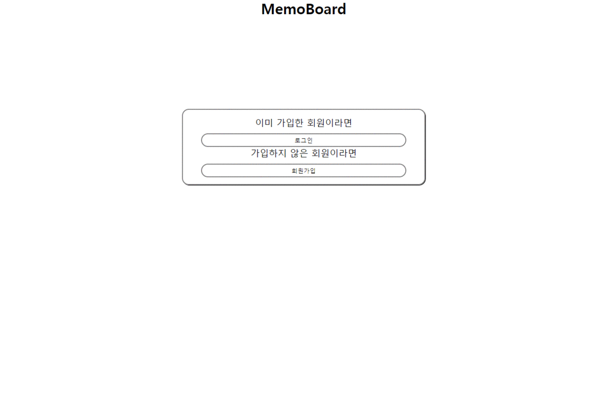
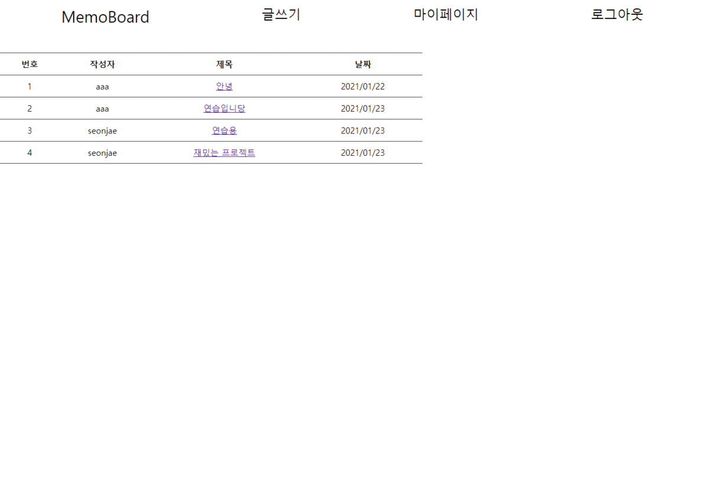
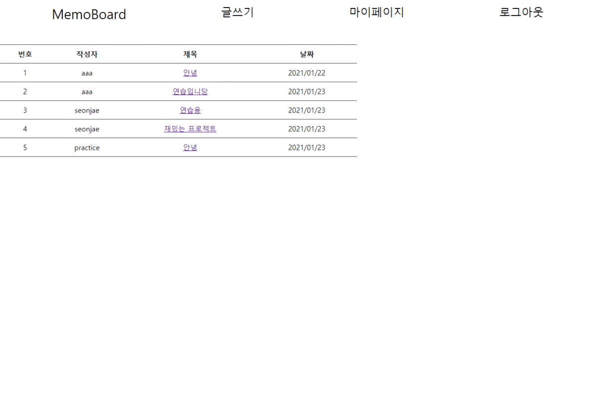
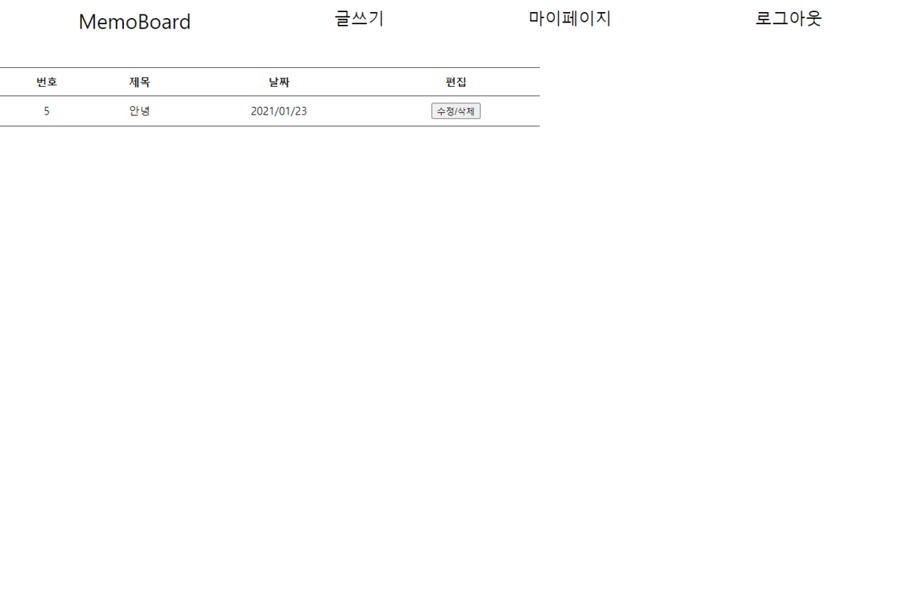

# 📋MemoBoard
  
MemoBoard는 `Memo`+`Board`의 합성어로 평소에 자신이 생각하거나 말하고싶은 내용을 게시판에 저장하는 것이다. 혼자 사용하는 메모 기능도 있지만 자신의 메모가 다른 사람들에게도 보여져 공유가 가능하다.
# ⚙구성도

# 기능
| **회원가입 및 로그인** |
|:---:|
||
|게시글 생성|
||
|게시글 읽기|
||
|게시글 수정|
||
|게시글 삭제|
||
|로그아웃|
||

